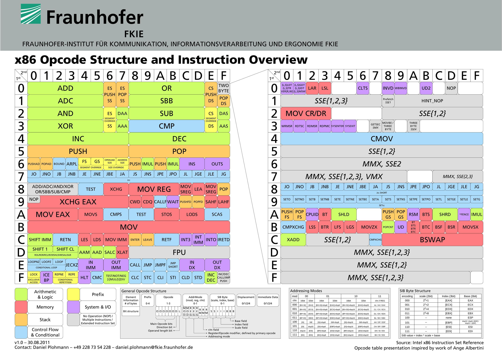

# Design An Assembler Assembler-X86
This is an assembler written in Python.

## Author: Seyed Ali Maher
## Student NO.: 9932113
## Creation Date: 1400-10-06
## Revision: 03

## Program Description

Design an assembler that converts assembly code to machine code. This assembler project supports instructions like ADD, AND, SUB, OR, and JMP.

## Improvements in Part 3

In this part, a short JMP instruction is added. Additionally, support is extended to handle the last parts (MOD = 11) and (MOD = 00).

## Warnings

1. We don't support 16 bits in MOD = 00!
2. For ah, ch, esp, and ebp, we consider them the same as other registers (No SIB).
3. Only one jump is allowed.

## Sources

- [Assembly Instructions Reference](http://www.c-jump.com/CIS77/CPU/x86/lecture.html#X77_0210_encoding_add_immediate)
- [Online Assembler and Disassembler](http://shell-storm.org/online/Online-Assembler-and-Disassembler/)

## Special Thanks

A great thanks to Mr. Mirhosseini for his awesome guidance during the development of this assembler.

## How to Use

1. Ensure you have Python installed on your machine.
2. Clone this repository to your local system.
3. Create an input text file named `InputsAsmCodes.txt` and add your assembly code to it.
4. Run the assembler using the command: `python assembler.py`.
5. The assembler will read the input file, process the instructions, and generate the corresponding machine code.
6. The output will be displayed in the console.

## Example Assembly Code

```assembly
; Example Assembly Code
ADD AX, BX
SUB CX, DX
AND AX, 0x0F
OR BH, AL
JMP LABEL

LABEL:
    ; Your code here
```


